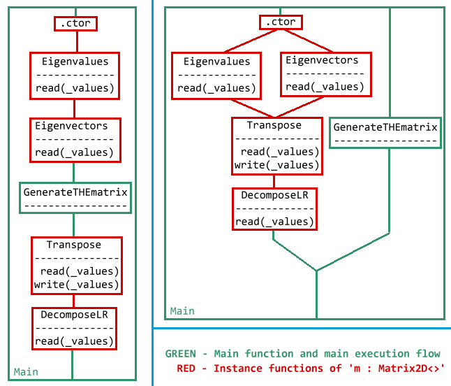

# [DRAFT] &nbsp; Purity / Determinism / Constant Functions / Constant Expressions

This proposal is dedicated to the often mentioned ideas of _"function purity"_, _"determinism"_, _"pre-compilation"_ and _"constant functions/expressions"_.

This article also mentions features and wishes expressed (more or less briefly) the following proposals:

- [dotnet/csharplang#504](https://github.com/dotnet/csharplang/issues/504): "Enable Compile-Time Folding of Deterministic Outputs"

- [dotnet/csharplang#776](https://github.com/dotnet/csharplang/issues/776): "C# Pure Function Keyword to Mark No Side Effects Or External Dependencies" 

- [dotnet/csharplang#1028](https://github.com/dotnet/csharplang/issues/1028): "Compile time expressions"

- [dotnet/csharplang#1413](https://github.com/dotnet/csharplang/issues/1413): "Compile-Time method inlining"

- [dotnet/roslyn#9627](https://github.com/dotnet/roslyn/issues/9627): "Compile Time Function Execution"

- [dotnet/roslyn#10506](https://github.com/dotnet/roslyn/issues/10506): "Static Expressions"

- [dotnet/roslyn#11259](https://github.com/dotnet/roslyn/issues/11259): "Constant string interpolation"

- [dotnet/roslyn#12238](https://github.com/dotnet/roslyn/issues/12238): "Compile time expressions"

- [dotnet/roslyn#14665](https://github.com/dotnet/roslyn/issues/14665): "Constant expression - Power operator?"

- [dotnet/roslyn#15079](https://github.com/dotnet/roslyn/issues/15079): "How would you imagine `constexpr` in C#?"

- [dotnet/coreclr#3633](https://github.com/dotnet/coreclr/issues/3633): "Optimizing `constant_string.Length`"

  

# Introduction

C# has been and currently is moving into the exiting field of functional programming. It is not at all a new field _(think about how old Haskell is!)_ - but it is a field with great potential and should therefore be explored and used in modern C# programming.

One important function is the so-called **determinism ** of functions and expressions. One can gain extreme performance, parallelism improvements if rightly used and analyzed. Furthermore, deterministic compiler approaches can prevent many run-time exceptions due to improved code transformation and analysis.

I will use the word **determinism** throughout most of this article - but you can think of it as  *pure functions*, *pre-compiled functions* or *pseudo-"constant" functions*.


## What does 'Determinism' mean?

In a broad mathematical and functional sense, determinism is the concept of function or expression declaration which always returns the same output for the same input.<br/>Mathematically speaking, this should look as follows:

If any function

is deterministic, then follows:


A C# example for deterministic functions are, e.g.:

```csharp
public static long FuncA() => 420L;

public static long FuncB(int x)
{
    long res = 0;
    
    for (int c = 0; c < x; ++c)
        res += c * 42;
    
    return res;
}
```
It is pretty obvious, that the function above always outputs the same result for the same input. But what about the following one?

```csharp
public static long FuncC(int x)
{
    long input = long.Parse(System.Console.ReadLine());
    
    return input + x * 42;
}
```

As `FuncC` uses `Console.ReadLine : void -> string`, the function `FuncC` can only be deterministic, if `ReadLine` is (which it of course isn't).

This example shows that for the purpose of this article, one shall define 'deterministic as follows':<br/>**A function is deterministic ⟺**

1. All parameters are deterministic
2. All inner function calls are deterministic
3. Any expression, expression chain or operation 'flow' is deterministic
4. All dependencies are deterministic (in time)

_Constant functions (functions composed only of constant values and expressions) are trivially deterministic._


## How can we differentiate between deterministic and non-deterministic functions?

To determine whether a function is deterministic (aka. "pure"), one must (recursively) look at all affected functions and variables:

- If a function **solely** accesses parameters, (constant) literals, local function variables and other deterministic functions, then it **definitely** is deterministic.

- If a function accesses **any** of the following components - it is **not** deterministic: 

  - Memory (physical or virtual)
  - Interrupt-based mechanics, such as devices (including the mouse) or timers
  - Stream-based mechanics, such as Networking, I/O, etc.
  - UI-based components, such as Windows, UI-message-queues (they often use interrupts)
  - P/Invoke calls (or any calls to non-deterministic code)

  The above components are also called _"side-effects"_, as any code operating with them can have undesired or non-deterministic _(read: non-repeatable)_ side-effects on the own application's state.

- If a function access _global_ (static or instance) variables, the determinism cannot always be ensured. The requirements for this must be: No external or non-deterministic code can access the variables in question. All functions accessing the global variable must be deterministic.

- For any other remaining cases, one must define in greater detail where the line has to be drawn between determinism and non-determinism.


# Why do we need this?

Good point. Why do we need this indeed?<br/>There are a couple of reasons out there:

### 1.) Performance: caching or look-up

Imagine having having a huge dataset with statistical data. Determinism could be used in a lot of mathematical functions handling this dataset. Examples could be the calculation of metrics, such as the standard deviation, median, regression expressions, etc...

Many performance aspects however come apparent on the _second_ call of a deterministic function:<br/>As the JIT **knows** a function to be deterministic, it could simply look-up its result upon re-calculation. The result would be correct, as the output of **any** deterministic function does not change, as long as the input parameters  remain unchanged.<br/>The JIT could have some kind of (partial) look-up table or cache for deterministic functions in order to hugely improve an application's performance.

### 2.) Performance: parallelism

As deterministic functions are only composed of deterministic function-calls and expressions, their code is **known** to be **side-effect free**. They can therefore often be parallelized safely in order to gain performance, as they are known to have no side-effects on the remaining application state.

If global variables are involved, some kind of functional dependency graph or transactional system has to be created by the compiler in order to insure the variable's determinism.

You could imagine the parallelism of deterministic functions along the lines of parallelism of `async` functions:

Having a set of deterministic functions with function `F` waiting for the result of function `G` at some point, one can pre-compute `F` in the background (in parallel) and "await" its result before passing it along to `G`, e.g:

```csharp
// deterministic
public static const string F(string s)
{
    return new string(s.ToUpperInvariant()
                       .Reverse()
                       .ToArray());
}

// non-deterministic
public static void G(object o) => Console.WriteLine(o?.ToString() ?? "<null>");

// non-deterministic
public static void Main()
{
    string input = Console.ReadLine();
    
    Thread.Sleep(1000); // or some other long-duration operation
    
    G(F(input));
}
```

If the calculation times are as follows:

```
			    F:    5ms
  Console.ReadLine:   10ms [+ wait for user input]
 Console.WriteLine:   10ms
Thread.Sleep(1000): 1000ms
```

one would expect the e.g. following _classic_ timeline:

```
ms: 0                           5000   5010      6010 6015   6025
    |-----WAIT FOR USER INPUT-----|------|---------|----|------|
  START                           READLINE  SLEEP    F  WRITELINE
```

The method `F`, however, is deterministic, so it could already be called at `5010 ms` instead of `6010 ms`. This is semantically perfectly valid, as `F` is **known** to have **no side-effect** on the rest of the application (or the rest of the application on `F`).<br/>The execution time of `Main` could therefore be effectively reduced by the calculation time of `F` (5 ms):

```
ms: 0                           5000   5010 5015     6010   6020        <-- overall time reduced
    |-----WAIT FOR USER INPUT-----|------|----|--------|------|
    |                             |      |--F-'        |      |         <-- F is executed
  START                           READLINE    SLEEP    WRITELINE              in parallel     
```

_Of course - this was an example with rather bad numbers, but you do get the idea_... ;)

### 3.) Performance: pre-compilation

Imagine the following function `sigmoid`:

```csharp
using static System.Math;

public static float sigmoid(float x) => Exp(x) / (Exp(x) + 1);
```

Assuming that the function `Math.Exp : float -> float` is deterministic, the function `sigmoid ` obviously also is. Upon compiling a program which contains the function `sigmoid`, the compiler could take a look at all call occurrences and replace the function calls with the pre-calculated result.

This could also be applied to string-manipulation, e.g.:

```csharp
string s = $"Hello {Math.PI:N3}!".ToLowerInvariant();
```

would _always_ result in the following value:

```csharp
"hello 3.142!"
```

### 4.) Elimination of (semantically) unused code

As deterministic functions are per definition side-effect free, one can safely remove code snippets inside those functions which have no effect on the return value. This is possible, as the semantics of the "optimized" functions do not differ from the "original" one.

An example:

```csharp
L01: public const float MyComplexFunction(float y)
L02: {
L03:     float x = MyComplexFunction(Sin(y));
L04:     
L05:     return y * 7;
L06: }
```

Traditionally, the execution of `MyComplexFunction : float -> float` would result into a `StackOverflowException` on line `L03` due to a never-ending recursive call. This could not be optimized with the traditional C# compiler, as the function is not even tail-recursive.

However, as we know that `MyComplexFunction` is deterministic, it is known to have no side effects. Therefore, we can omit the line `L03` entirely, as its results will never effect the return value of `MyComplexFunction`.

The compiler could now remove `L03` **and** issue the hint `Removed line L03, as it has no effects on the function's semantics.`, instead of only issuing a warning `Unused variable 'x' in line L03.` and _leaving the line `L03` untouched._

The compiled result would be:

```csharp
public const float MyComplexFunction(float y) => y * 7;
```

Which would operate as **semantically** expected.

### 5.) Reduction of error sources

The usage of determinism could greatly reduce the amount of produced errors, as potential conflicts could be determined by the compiler (e.g. eventual overflow or division-by-zero). If the application of determinism in C# could be broadened to -- let's say -- discriminated unions and pattern matching, many patterns could be detected by the compiler which would e.g. never be matched etc.

Determinism could also be applied to the upcoming C#8.0-feature of nullable reference types: Determinism could provide the compiler with improved methods of tracking null references.

### 6.) More compile-time constants!!

Many expressions can be transformed to be compile-time constants, if all underlying (arithmetic) operators and function calls are insured to be deterministic. This enables the usage of compile-time constants in many more places.

Please take a look at the following chapter (especially [this section](#constant-expressions)) for more information.


# OK, I get it. But what would it look like?

There are multiple designs which this proposal could adopt:

- **"Conservative determinism":**<br/>The compiler should only employ determinism if the developer says to do so. This could implemented as follows:
  - A keyword like `const` or `pure` to mark deterministic functions.<br/>_My favorite solution for now is the usage of the existing keyword `const`, so I will stick to that throughout this article._
  - An compiler-intrinsic attribute, e.g. `[Pure] `or `[Determinsitic]` which would have the same effect as the keyword(s) mentioned above.
- **"Aggressive determinism:"**<br/>The compiler shall _greedily_ assume any function as being deterministic and require the developer to mark non-deterministic functions as such.<br/>This could be the proposal's "final" goal in the far-away future. However, such a behavior would be a breaking change at the current stage.

For the purpose of this proposal, we settle on **"Conservative determinism"** with the keyword `const` as determinism-marker for now.

-----

## Examples:

### Deterministic functions

```csharp
/// calculate hyperbolic cotangent
public static const float Coth(float x) => (Exp(2 * x) + 1) / (Exp(2 * x) - 1)
```

This would the function `System.Math.Exp : float -> float` also require to be marked as `const`.<br/>Any call **_from_ a deterministic** function **_to_ a _non_-deterministic** one would result in a compiler **error**:

```csharp
public static DateTime GetToday() => DateTime.Now;

public static const DateTime GetNextDay()
{
    DateTime today = GetToday();
    //               ^^^^^^^^^^ ERROR
    // A non-deterministic function cannot be called from a deterministic one.
    
    return today.AddDays(1);
}
```

If the function `GetToday : void -> DateTime` would be marked as `const`, the error would "shift" as follows:

```csharp
public static const DateTime GetToday() => DateTime.Now;
//                                                  ^^^ ERROR
// A non-determinisitic property cannot be accessed from a determinisitic function.     

public static const DateTime GetNextDay()
{
    DateTime today = GetToday();
    
    return today.AddDays(1);
}
```

It is needless to say that calls **_from_ a _non_-deterministic** function **_to_ a deterministic** one are perfectly **valid**.

### Deterministic types

A type can be marked as deterministic, if it is `sealed` and all containing methods are deterministic. Furthermore, deterministic types cannot be modified via memory operations such as pointer, pinning or P/Invoke operations:

```csharp
public const struct Point2Df
{
    public const float X { get; }
    public const float Y { get; }
    
    ....
}


Point2Df point = new Point2Df();
Point2Df* ptr = &point;
//      ^       ^^^^^^ ERROR
// Cannot take address of deterministic datatyoe 'Point2Df'.
```

For now, only classes and (managed) read-only structures should be valid candidates for deterministic datatypes.

A deterministic type could look as follows:

```csharp
public const sealed class ComplexNumber
{
    private float _re, _im;
    
    
    // deterministic constructor
    public const ComplexNumber()
        : this(0, 0) { }
    
    // deterministic constructor
    public const ComplexNumber(float re)
        : this(re, 0) { }
    
    // deterministic constructor
    public const ComplexNumber(float re, float im)
    {
        _re = re;
        _im = im;
    }
    
    // deterministic function (this requires "Sqrt : float -> float" to be deterministic)
    public const float GetMagnitude() => Sqrt(_re * _re + _im * _im);
}
```

### Deterministic operators and properties

Properties and (custom) operators can only be used inside deterministic functions or expressions, if they are also marked as `const`. The syntax would look along these lines:

```csharp
public const sealed class ComplexNumber
{
    .....
    
    // deterministic read-only property
    public const float Imaginary => _im;
    
    // deterministic read-write property
    public const float Real
    {
        get => _re;
        set => _re = value;
    }
    
    public static const ComplexNumber operator+(ComplexNumber c1, ComplexNumber c2) =>
        new ComplexNumber(c1._re + c2._re, c1._im + _c2.im);
}
```

The code above could be compiled into something like this:

```csharp
public const sealed class ComplexNumber
{
    .....
    
    public const float get_Imaginary() => this._im;
    
    public const float get_Real() => this._re;
    
    public const void set_Real(float $value) => this._re = $value;
    
    public static const ComplexNumber op_Addition(ComplexNumber c1, ComplexNumber c2) =>
        new ComplexNumber(c1._re + c2._re, c1._im + _c2.im);
}
```

which are all deterministic functions.

### Deterministic flow control

Determinism would also expand to flow control, e.g.:

```csharp
public static const float GetMagicNumber(float x) => x / 0f;
// Compiler detects that the function above always returns float.Infinity

public static const string GetMagicString(int i)
{
    float res = GetMagicNumber(i + 42.0f);
    
    if (float.IsInfinity(res))
        return "Oh noes!";
    else
    {
        return "Yes!";
    }
}
// As all used constructs are deterministic, the compiler would replace any call of the
// function 'GetMagicString : int -> string' with the constant string "Oh noes!".
```

### Constant expressions

Determinism naturally extends to expressions, meaning that the expression `420f / 10f` is expected to always yield the result `42f`. One could therefore redefine compile-time constant expressions:

**The value of an expression is known at compile-time if it is only composed constant literals and deterministic function calls with constant parameters.**

This would e.g. enable the following expression to be compile-time constant:

```csharp
public const int MY_CONSTANT = $"Hello, {Math.E}!"[7] - '\x8';
```

It would be composed as follows during compile-time:

```csharp
public const int MY_CONST = $"Hello, {Math.E}!"[7] - '\x8';
//	equals:                 (int)string.Format("Hello, {0}", Math.E).get_Chars(7) - (int)'\x8'
//                          (int)     "Hello, 2.71828182845905!"    .get_Chars(7) - (int)'\x8'
//                          (int)                       '2'                       - (int)'\x8'
//                                      int.op_Implicit('2')      -      int.op_Implicit('\x8')
//                                             int.op_Subtract(50, 8)
//                                                       42
```

The compiler would build an expression tree of the expression `MY_CONSTANT : int` and only evaluate its value if the following functions are deterministic or constant:

```
string.Format : string -> obj[] -> string
string.get_Chars : string -> int -> char
int.op_Implicit : char -> int
int.op_Subtract : int -> int -> int
```

The compiler would then issue the following IL for the expression above:

```assembly
.field public static literal int32 MY_CONSTANT = int32(42)
```


Constant expressions could be used as default parameter value:

```csharp
public static float FuncF(float x, float y = Sin(2 * PI) / 14)
//                                           ^^^^^^^^^^^^^^^^
//                                           This will be evaluated at compile-time!!
{
    return Tan(x) * y;
}
```


Naturally, the usage of compile-time constants (in the deterministic sense) could be expanded to attributes:

```csharp
[Obsolete($"Perfectly valid code! {nameof(MyFunc)} is obsolete -- and this is compile-time constant! {Math.Pow(0.025, -1) + 2}")]
public void MyFunc() { ... }
```

Which would evaluate to:

```csharp
[Obsolete("Perfectly valid code! MyFunc is obsolete -- and this is compile-time constant! 42")]
public void MyFunc() { ... }
```

### Deterministic Attributes (?)

A possible idea would be to allow determinism to be allowed in attributes as well:

```csharp
public const delegate bool DeterministicFunc(float f);

public const sealed class CheckParameterAttribute
    : Attribute
{
    ...
    
    const public CheckParameterAttribute(DeterministicFunc<float, bool> predicate)
    {
    	...
    }
}


public const void funcE(
    [CheckParameter(const f => f > -1 && f < 1)]
    float f
)
{
	...
}
```

This would, however, require a language change (except if a deterministic function handle or `.text` offset would be stored as a constant inside the attribute ....)

### What about accessing type/global variables?

Well -- this is a more complex matter. Imagine having the following code:

```csharp
public const struct Matrix2D<const T>
{
    private T[,] _values;
    
    
    public const Matrix2D(int n, int m) =>
        _values = new T[n, m];
    
    public const void Transpose() { ... }
    public const T[] Eigenvalues() { ... }
    public const Vector<T> Eigenvectors() { ... }
    public const (Matrix2D<T> Left, Matrix2D<T> Right) DecomposeLR() { ... }
    
    public static const Matrix2D<T> GenerateTHEmatrix() { ... }
}
```

Let's imagine the following access patterns:

| method                                            | variable             | access       |
| ------------------------------------------------- | -------------------- | ------------ |
| `.ctor : int -> int -> Matrix2D<T>`               | `_values` (instance) | write        |
| `Transpose : void -> void`                        | `_values` (instance) | read, write  |
| `Eigenvalues : void -> T[]`                       | `_values` (instance) | read         |
| `Eigenvectors : void -> Vector<T>`                | `_values` (instance) | read         |
| `DecomposeLR : void -> Matrix2D<T> * Matrix2D<T>` | `_values` (instance) | read         |
| `GenerateTHEmatrix : void -> Matrix2D<T>`         | &lt;none&gt;         | &lt;none&gt; |


If the code of our `Main`-function looks as follows:

```csharp
public static const void Main(string[] argv)
{
    Matrix2D<float> l, r, m, n;
    Vector<float> ev;
    float[] e;
    
    m = new Matrix2D<float>(5, 5);
    .... // fill values into m
        
    n = Matrix2D.GenerateTHEmatrix(); // some really time-intensive operation
        
    e = m.Eigenvalues();
    ev = m.Eigenvectors();
        
    m.Transpose();
    
    (l, r) = m.DecomposeLR();
}
```

One cannot parallelize `Transpose` and `DecomposeLR` trivially, as they have conflicting access patterns to the same type variable (in this case `m._values : float[]`). However, the function calls of `Eigenvalues` and `Eigenvectors` are parallelizable, as both only require a read-access on the type variable `m._vlaues`.

The compiler must create some kind of functional dependency graph (a bit like transactional database systems do), in order to parallelize as much code as possible:



 _[Ignore the absolutely mad MSPaint skillz™]_<br/>On the left-hand side one can see the serial (imperative) execution of the functions in the code example above. After building a deterministic execution tree, the compiler would use the dependency graph on the right-hand side in order to parallelize as much code as possible without causing semantic inconsistencies.

The following access conflict table should be used when checking whether two sequential accesses `T1` and `T2` can be parallelized when accessing the same variable `x`:

|     `T1 -> T2`      | `T1` : read(x) | `T1` : write(x) |
| :-----------------: | :------------: | :-------------: |
| **`T2` : read(x)**  |      yes       |       no        |
| **`T2` : write(x)** |       no       |       no        |

If the dependency graph shows a cyclic dependency, all deterministic functions must be executed in sequence (traditional code execution order).

----

### TL;DR

In general, the compiler could follow the following guidelines for deterministic functions:

- no parameters, no type variable access ⟹ calculate function result **at compile-time**.
- parameters, but all calls pass constant values ⟹ calculate function result **at compile-time**.
- parameters, no type variable access ⟹ calls can be calculated **asynchronously**.
- type variable access ⟹ compiler has to resort to a dependency graph etc. in order to insure correctness.

# Issues / Drawbacks / Questions

This goes without saying, that such complex determinism analysis requires a lot of work. The following points are some issues, drawbacks and open questions which I thought of:

- **This requires a language change.** The `const`- or `[Deterministic]`-marker could be issued as IL-Metadata, but I am not sure whether it is enough. IMO, `const` should be part of a deterministic function's signature -- however -- functions should not be overloadable by the `const`-marker only.<br/>A language change is definitely required if determinism is to be allowed for Attribute constructors with non-constant _(but deterministic)_ attributes.

- **Core framework changes.** Many, many CoreFX functions could be transformed to be deterministic, e.g. most mathematic and LINQ functions.

- **How are deterministic APIs exposed?** That's a very good question.

  - **Should they act like regular functions?** That would detain the compiler from pre-compiling some deterministic functions.
  - **Should precompiled functions be accessible as constants?** Maybe - but that does not sound like .NET-consistent compiler behavior.

- **What happens with reflection-invoked deterministic functions?** They should act like API-exposed ones; meaning that the solution to the API-question above would be the same for reflection-invocation.

- **Deterministic Generics? Interfaces?** Definitely!<br/>One could introduce some constraints as follows:

  ```csharp
  public interface IVector<const T>
  {
      const T ScalarZero { get; }
      const T ScalarOne { get; }
      
      const IVector<T> VectorZero { get; }
      const IVector<T> VectorOne { get; }
      
      const IVector<T> VectorAdd(IVector<T> other);
      const IVector<T> ScalarMultiply(T scalar);
  }
  ```

- **What about deterministic λs and delegates?** Maybe like this:

  ```csharp
  const delegate bool DeterministicPredicate<const T>(T value);
  
  
  public const T[] LINQWhere<const T>(T[] input, DeterministicPredicate<T> predicate)
  {
      List<T> result = new List<T>();
      
      foreach (T element in input ?? new T[0])
          if (predicate(element))
              result.Add(element);
      
      return element.ToArray();
  }
  
  public static const void Main(string[] argv)
  {
      int[] source = { 3, 1, 5, 4, 2, -88 };
      int[] result = LINQWhere(source, const i => (i % 2) != 0);
  }
  ```

# Conclusion

**IS THIS WORTH IT?**<br/>Yes - I **definitely** think that the effort is worth the drawbacks for a long-time future.

The C#8.0 feature `nullable reference types` already goes into the right direction. However, I think that a whole lot more potential and performance can be gained from this proposed language feature.

IMO, It would definitely require a breaking CLI change (which would incidentally be a good excuse to clean-up the CLI and its instruction set :wink:).

The huge workload involved in the implementation would therefore make it a candidate for a major language version (e.g. C#-10).